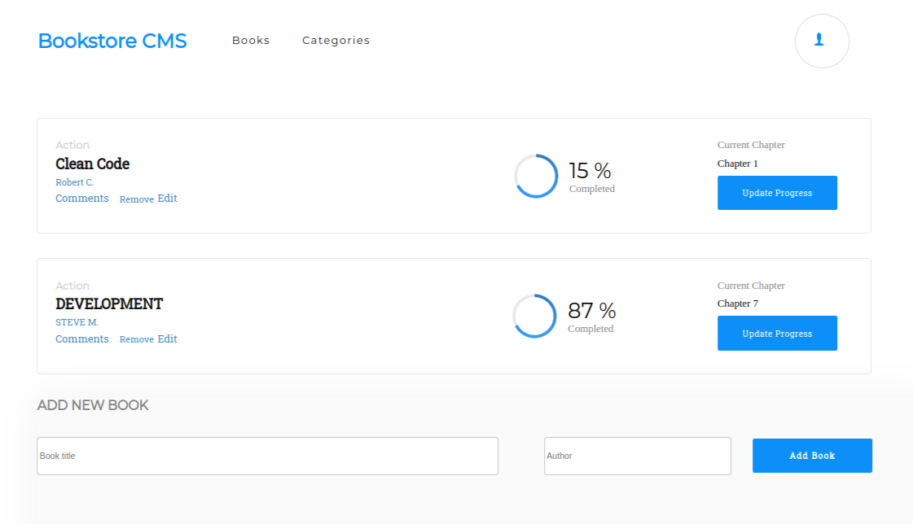

# Book Store

> This is a website that allows users to add and remove books.

## Built With

- XML
- CSS
- React
- Routers

## Getting Started

To get a local copy up and running follow these simple example steps.

- Clone repository in your local machine 
- cd Math-Magicians-React
- open `index.html` in your browser.
- You can use live server.

## Live Demo

[BookStore Live](https://effortless-kulfi-65ca17.netlify.app/)

## Author

👤 **Sajid Munawar**

- GitHub: [@githubhandle](https://github.com/sajid-munawar)
- LinkedIn: [LinkedIn](https://www.linkedin.com/in/sajid-munawar-41ba26180/)

## 🤝 Contributing

Contributions, issues, and feature requests are welcome!

Feel free to check the [issues page](https://github.com/sajid-munawar/Book-Store-React/issues)

## Show your support

Give a ⭐️ to if you like this project!

## Acknowledgments

- Hat tip to anyone whose code was used
- Inspiration
- etc

## 📝 License

This project is [MIT](./MIT.md) licensed.

